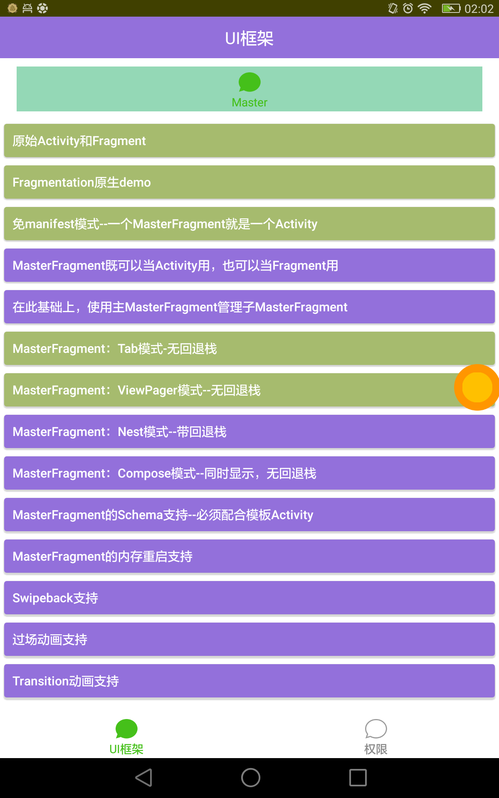
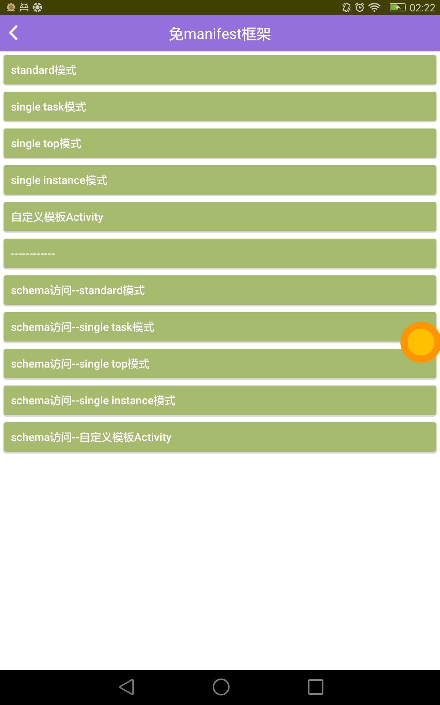
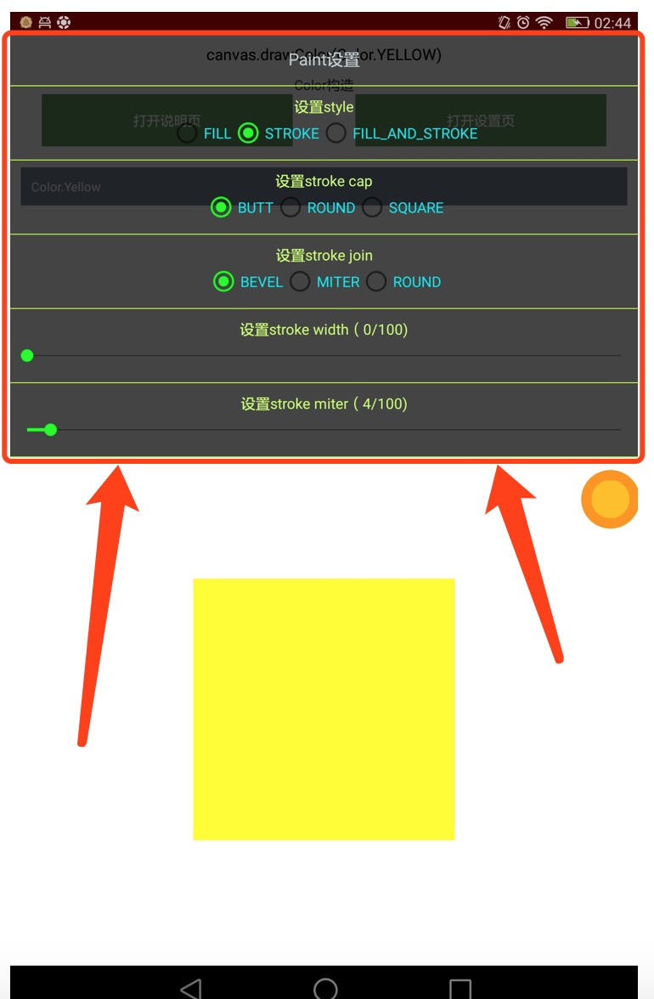

# AyoCompoment
基本组件，页面框架，搭建项目开始时要考虑的问题
----------------------

内容包括：
- Activity，Fragment组件，UI组件基于Fragmentation
    - 支持Activity核心或者Fragment核心
    - 支持免manifest的Fragment核心，支持Schema和内存重启
- WorkThread的问题：是用IntentService，还是HandlerThread，还是开线程池，还是用AsyncTask，还是直接new Thread
- Service，Provider，Receiver

没整到jcenter上，暂时就用aar包吧，也挺省劲：[下载地址](https://github.com/cowthan/AyoCompoment/blob/master/ayo-component.aar?raw=true)
下载下来文件名是：ayo-component.aar，拷到libs目录里
然后在build.gradle里引入：
```
repositories {
    flatDir {
        dirs 'libs'
    }
}

compile(name:'ayo-component', ext:'aar')
```


目录：
- MasterFragment使用
    - 主题：Theme，Material Theme
    - 模板Activity声明：内置和自定义，Activity在manifest里配置的可选项
    - 屏幕旋转
    - SystemBar一体化问题
    - 启动加速
    - ayo-menu的使用：写demo时用的菜单组件
- WorkThread，Service问题
- ContentProvider是否应该作为你app内数据库管理的第一选择
- Receiver和EventBus的选择，EventBus能跨进程吗
- 多进程问题的考虑

## 1 MasterFragment使用

* Master框架都提供了：
    * Fragmentation的拷贝和修改（生命周期相关修改）
    * MasterFragment：基于Fragmentation，可以：
        * 通过Master的startPage方法和一个预先声明的模板Activity绑定，达到免manifest的目的
        * 可以嵌在MasterActivity里，这个方式就是最传统的方式，用Activity加载Fragment
        * 可以嵌在MasterFragment里，这个方式也是传统的方式，用Fragment加载Fragment
    * 不论是MasterActivity，还是MasterFragment，都可以：
        * 加载一个Fragment，成为其父
        * 同时显示多个Fragment，成为他们的父
        * 同时打开多个，并通过show和hide控制，这些child之间不会有后退关系
        * 通过ViewPager管理多个Fragment
        * 打开多个，但不是同时打开，通过add，pop等控制，会有后退关系
    * MasterFragment和MasterActivity，还考虑了：
        * 和Fragment相关的内存重启，需要注意在create时判断saveStateInstance是否为空，不要重复load fragment
            * fragment本身会在其父中被save和恢复，只需要读出来
            * fragment的setArgument带的参数会save和恢复，只需要读出来
        * Schema
        * 过场动画
        * Transition动画
        * 滑动返回
        * SystemBar一体化
        * 生命周期，便于统计
        * Fragment可见和不可见的生命周期，以及是否第一次可见，都保证View已经初始化，代替ViewPager的setUserHintVisi..，可以真正实现Fragment各处通用


### 1 到底用什么UI框架

* 先说说都有什么UI框架
    * 本项目的初衷：免Manifest框架
        * tmpl里的几个Activity需要事先声明，当然也可以自己定制，自己处理Fragment加载和schema等问题
        * 实现业务Fragment，需要继承MasterFragment，注意几个生命周期
        * 打开Fragment：
            * 你可以再写一个Activity（继承MasterActivty），来加载你的Fragment，这是传统套路
            * 你也可以通过Master里的startPage方法，打开你的Fragment，这个方式可以不用在manifest再声明什么
        * 支持MasterTabFragment，和MasterPagerFragment，这俩是Tab页和ViewPager页
    * 由于拷进了Fragmentation，所以也支持它的几个典型框架了：
        * 一个Activity，多个Fragment：这些Fragment可以是平级，有栈关系，有for result关系
        * 多个Activity，多个Fragment：和单Activity本质一样
        * 关于Fragmentation的高级用法，咱先不考虑，暂时就把Fragmentation当成一个封装了Fragment生命周期的功能模块

### 2 Theme配置


Master是基于AppCompatActivity，也就只能用AppCompat的主题，这类主题会按照API 21划分，21以上会加载Material的主题，所以也支持Transition等design的东西

```
------values目录的style.xml
<style name="AppTheme" parent="Theme.AppCompat.Light.NoActionBar">
	<!-- Customize your theme here. -->
	<item name="colorPrimary">@color/colorPrimary</item>
	<item name="colorPrimaryDark">@color/colorPrimaryDark</item>
	<item name="colorAccent">@color/colorAccent</item>

	<item name="android:windowNoTitle">true</item>
	<item name="android:windowContentOverlay">@null</item>
	<item name="android:windowBackground">@android:color/transparent</item>
</style>

<style name="AppTheme.Splash" parent="Theme.AppCompat.Light.NoActionBar">
	<item name="android:windowBackground">@drawable/logo</item>
</style>

<style name="AppTheme.Transparent" parent="Theme.AppCompat.Light.NoActionBar">
	<item name="android:windowIsTranslucent">true</item>
	<item name="android:windowAnimationStyle">@style/Animation.Activity.Translucent.Style</item>
</style>

<style name="Animation.Activity.Style" parent="@android:style/Animation.Activity">
    <item name="android:activityOpenEnterAnimation">@anim/base_slide_in_from_right</item>
    <item name="android:activityOpenExitAnimation">@anim/base_hold_stand</item>
    <item name="android:activityCloseEnterAnimation">@anim/base_hold_stand</item>
    <item name="android:activityCloseExitAnimation">@anim/base_slide_out_to_right</item>
    <item name="android:taskOpenEnterAnimation">@anim/base_slide_in_from_right</item>
    <item name="android:taskOpenExitAnimation">@anim/base_hold_stand</item>
    <item name="android:taskCloseEnterAnimation">@anim/base_hold_stand</item>
    <item name="android:taskCloseExitAnimation">@anim/base_slide_out_to_right</item>
    <item name="android:taskToFrontEnterAnimation">@anim/base_slide_in_from_right</item>
    <item name="android:taskToFrontExitAnimation">@anim/base_hold_stand</item>
    <item name="android:taskToBackEnterAnimation">@anim/base_hold_stand</item>
    <item name="android:taskToBackExitAnimation">@anim/base_slide_out_to_right</item>
</style>

<style name="Animation.Activity.Translucent.Style" parent="@android:style/Animation.Translucent">
    <item name="android:windowEnterAnimation">@anim/base_slide_in_from_right</item>
    <item name="android:windowExitAnimation">@anim/base_slide_out_to_right</item>
</style>

-------values-21目录的style.xml
<style name="AppTheme" parent="Theme.AppCompat.Light.NoActionBar">
	<!-- Customize your theme here. -->
	<item name="colorPrimary">@color/colorPrimary</item>
	<item name="colorPrimaryDark">@color/colorPrimaryDark</item>
	<item name="colorAccent">@color/colorAccent</item>
	<item name="android:textColorPrimary">@color/textColorPrimary</item>
	<item name="android:navigationBarColor">@color/navigationBarColor</item>
	<item name="android:colorControlHighlight">@color/colorControlHighlight</item>

	<item name="android:windowNoTitle">true</item>
	<item name="android:windowContentOverlay">@null</item>
	<item name="android:windowBackground">@android:color/transparent</item>
</style>


------colors.xml
<?xml version="1.0" encoding="utf-8"?>
<resources>
    <color name="colorPrimary">#ff0000</color>
    <color name="colorPrimaryDark">#ffff00</color>
    <color name="colorAccent">#00ff00</color>
    <color name="colorControlHighlight">#e60000</color>
    <color name="textColorPrimary">#000000</color>
    <color name="navigationBarColor">#ff00ff</color>

    <color name="green">#a3c639</color>
    <color name="dark_green">#85a71d</color>
    <color name="yellow">#ff0</color>
    <color name="gray">#ccc</color>
    <color name="pink">#e91e63</color>
</resources>


-------logo.xml
<?xml version="1.0" encoding="utf-8"?>
<layer-list xmlns:android="http://schemas.android.com/apk/res/android" >
    <item>

        <shape android:shape="rectangle" >
            <solid android:color="#ffffff" />
        </shape>
    </item>

    <item android:bottom="48dp">
        <bitmap
            android:gravity="center"
            android:src="@drawable/img1" />
    </item>
</layer-list>

```

关于Color Pallete：
- 单词我都不知道有没有拼对
- 有图就不用说话：
!()[./img/l-design.png)


关于windowIsTranslucent：
- 大多数情况下，是要配合swipe back功能来使用，所以模板Activity为了考虑所有情况，最好使用AppTheme.Transparent
- 这个设为true会引入一些问题，具体我现在都想不起来，以后慢慢在这记录吧
- 第一个问题：Activity切换动画无效化了，需要自己设置，参考windowAnimationStyle

Splash主题为什么单独拎出来：
- 主要是为了设置一个特殊的windowBackground，避免app打开过慢时出现白屏或者没反应的尴尬，以一个背景占位
- 所以Splash初次打开时，待在屏幕上的时间可能会比你设置的时间要长，长出来的时间就是app初始化时间
- 关于冷启动，热启动的优化，参考这里：http://www.jianshu.com/p/f5514b1a826c?utm_campaign=hugo&utm_medium=reader_share&utm_content=note&utm_source=qq


### 3 Manifest配置：

下面是manifest配置：
- 注意，四个模板的schema访问方式是：ayo://page/standard?page=fragment全限定名&name=value"
    - 其中，name和value可以有多对，都会被放到Fragment的argument里，相当于通过bundle传参数
    - page参数一定要有
    - 如果没有page，则表示打开的不是一个模板Activity，而是一个具体Acitity，其内部已经知道自己要加载哪个Fragment了


```
<activity android:name=".SplashActivity"
    android:configChanges="orientation|screenSize|keyboardHidden|navigation"
    android:screenOrientation="portrait"
    android:launchMode="standard"
    android:theme="@style/AppTheme.Splash">
    <intent-filter>
        <action android:name="android.intent.action.MAIN" />
        <category android:name="android.intent.category.LAUNCHER" />
    </intent-filter>
</activity>
<activity android:name=".MainActivity"
    android:configChanges="orientation|screenSize|keyboardHidden|navigation"
    android:screenOrientation="portrait"
    android:launchMode="standard"
    android:theme="@style/AppTheme">
    <intent-filter>
        <action android:name="android.intent.action.MAIN" />
        <category android:name="android.intent.category.LAUNCHER" />
    </intent-filter>
</activity>

<activity
    android:name="org.ayo.component.tmpl.TmplStarndardActivity"
    android:configChanges="orientation|screenSize|keyboardHidden|navigation"
    android:screenOrientation="portrait"
    android:launchMode="standard"
    android:theme="@style/AppTheme.Transparent" >
    <intent-filter>
        <category android:name="android.intent.category.DEFAULT"/>
        <action android:name="android.intent.action.VIEW"/>
        <category android:name="android.intent.category.BROWSABLE"/>
        <data android:scheme="ayo" android:host="page" android:path="/standard" />
    </intent-filter>
</activity>
<activity
    android:name="org.ayo.component.tmpl.TmplSingleTopActivity"
    android:configChanges="orientation|screenSize|keyboardHidden|navigation"
    android:screenOrientation="portrait"
    android:launchMode="singleTop"
    android:theme="@style/AppTheme.Transparent"  >
    <intent-filter>
        <category android:name="android.intent.category.DEFAULT"/>
        <action android:name="android.intent.action.VIEW"/>
        <category android:name="android.intent.category.BROWSABLE"/>
        <data android:scheme="ayo" android:host="page" android:path="/singletop" />
    </intent-filter>
</activity>
<activity
    android:name="org.ayo.component.tmpl.TmplSingleTaskActivity"
    android:configChanges="orientation|screenSize|keyboardHidden|navigation"
    android:screenOrientation="portrait"
    android:launchMode="singleTask"
    android:theme="@style/AppTheme.Transparent"  >
    <intent-filter>
        <category android:name="android.intent.category.DEFAULT"/>
        <action android:name="android.intent.action.VIEW"/>
        <category android:name="android.intent.category.BROWSABLE"/>
        <data android:scheme="ayo" android:host="page" android:path="/singletask" />
    </intent-filter>
</activity>
<activity
    android:name="org.ayo.component.tmpl.TmplSingleInstanceActivity"
    android:configChanges="orientation|screenSize|keyboardHidden|navigation"
    android:screenOrientation="portrait"
    android:launchMode="singleInstance"
    android:theme="@style/AppTheme.Transparent"  >
    <intent-filter>
        <category android:name="android.intent.category.DEFAULT"/>
        <action android:name="android.intent.action.VIEW"/>
        <category android:name="android.intent.category.BROWSABLE"/>
        <data android:scheme="ayo" android:host="page" android:path="/singleinstance" />
    </intent-filter>
</activity>
```

### 4 自定义模板Activity

可能有些业务需要你自己定义模板Activity，如支持屏幕旋转，需要在manifest配置个性化参数等，然后在manifest声明
```
public class CustomTmplActivity extends TmplBaseActivity {

}

<activity
    android:name=".master.CustomTmplActivity"
    android:configChanges="orientation|screenSize|keyboardHidden|navigation"
    android:screenOrientation="portrait"
    android:launchMode="standard"
    android:theme="@style/AppTheme.Transparent"  >
    <intent-filter>
        <category android:name="android.intent.category.DEFAULT"/>
        <action android:name="android.intent.action.VIEW"/>
        <category android:name="android.intent.category.BROWSABLE"/>
        <data android:scheme="ayo" android:host="page" android:path="/custom1" />
    </intent-filter>
</activity>
```

### 5 实现业务逻辑

开始干活了
- `实现业务Fragment了，继承MasterFragment，MasterTabFragment，MasterPagerFragment吧`
- 不过需要注意的是，一般你的项目内不会直接继承MasterFragment什么的，而是会先提供一层基类
    - 在基类里能做一些统计之类的事
    - 基类，或者第三方库的一层封装，能让你的业务逻辑和外部库解耦，方便替换和修改

MasterFragment的生命周期：
- onCreate2(View contentView, @Nullable Bundle savedInstanceState)
- onDestory2()
- onPageVisibleChanged(boolean visible, boolean isFirstTimeVisible, @Nullable Bundle savedInstanceState)
- 这里如果有疑问，建议先去看看Fragmentation的文档和demo，虽然我们没有用到它所有功能，但思想上的事，都是相通的
- 地址在这：https://github.com/YoKeyword/Fragmentation
- 另外，切记不要直接用Fragmentation升级本库，为了生命周期的顺序问题，其源码我已经修改过了，后面会对这里的修改做标记

提供了几个样板页：
- 普通页面：MasterFragment
- Tab页：MasterTabFragment
- ViewPager页：MasterPagerFragment
- 列表页：还没
- Splash页：还没

```
public abstract class BasePage extends MasterFragment {

    /**
     * 所有页面通过这个方法来打开
     * @param a
     * @param pageClass
     * @param bundle
     * @param tmplClass
     */
    public static void startPage(Activity a, Class<? extends MasterPage> pageClass, Bundle bundle, Class<? extends TmplBaseActivity> tmplClass){
        Master.startPage(a, pageClass, bundle, tmplClass);
        //如果extends MasterActivity，则这里换成：Master.startActivity(a, pageClass, bundle);
    }
    /**
     * 所有页面通过这个方法来打开
     * @param a
     * @param pageClass
     * @param bundle
     */
    public static void startPage(Activity a, Class<? extends MasterPage> pageClass, Bundle bundle){
        Master.startPage(a, pageClass, bundle);
        //如果extends MasterActivity，则这里换成：Master.startActivity(a, pageClass, bundle);
    }

}


public class DemoFragment extends BasePage {


    @Override
    protected int getLayoutId() {
        return R.layout.ac_demo_component;
    }

    @Override
    protected void onCreate2(View contentView, @Nullable Bundle savedInstanceState) {
        Toaster.toastShort(getActivity().getClass().getName());
        TextView title = (TextView) contentView.findViewById(R.id.title);
        TextView title2 = (TextView) contentView.findViewById(R.id.title2);

        title.setText(getActivity().getClass().getName());
        title2.setText("haha = " + getArguments().get("haha"));
    }

    @Override
    protected void onDestroy2() {

    }

    @Override
    protected void onPageVisibleChanged(boolean visible, boolean isFirstTimeVisible, @Nullable Bundle savedInstanceState) {
        String s = "onPageVisibleChanged--{dd}->" + getClass().getSimpleName() + ", " + (isFirstTimeVisible ? "是" : "非") + "第一次";
        s = s.replace("{dd}", visible ? "来了" : "走了");
        Log.i("MainActivity", s);
    }

}
```

### 6 打开界面

```
最原始的打开界面方法是Master类里的这个方法：
public static void startPage(Activity a, Class<? extends MasterFragment> clazz, Bundle b, Class<? extends Activity> tmplActvity){
    Intent intent = new Intent(a, tmplActvity);
    intent.putExtra("data", b);
    intent.putExtra("page", clazz.getName());
    a.startActivity(intent);
}

public static void startPageForResult(Activity a, Class<? extends MasterFragment> clazz, Bundle b, Class<? extends Activity> tmplActvity, int requestCode){
    Intent intent = new Intent(a, tmplActvity);
    intent.putExtra("data", b);
    intent.putExtra("page", clazz.getName());
    a.startActivityForResult(intent, requestCode);
}

大体上所有的trick都在这里了，其实这没啥，就是指定打开哪个Activity，让它加载哪个Fragment，哎卧槽，一点儿没技术含量
```

接收返回结果：
```
@Override
public void onActivityResult(int requestCode, int resultCode, Intent data) {
    super.onActivityResult(requestCode, resultCode, data);
}
```

### 7 状态栏一体化

```
注意，这两个方法总是得一块用，不要单独用
///status bar和navigate bar的颜色，如果是浅色，还需要配合SystamBarExtra里的方法加以优化，但不支持三星手机
getAgent().renderSystemBar(Color.YELLOW, Color.GREEN);
///status bar和navigate bar是否被侵占
getAgent().enableSystemBarTakenByContent(false);


这两个方法其实是对应着主题里的：
<item name="colorPrimary">@color/colorPrimary</item>
<item name="colorPrimaryDark">@color/colorPrimaryDark</item>
<item name="colorAccent">@color/colorAccent</item>
和布局里的：
fitSystemWindow="true"

当然，代码里设置的优先级比较高
```

下面多说点，systembar涉及到两个问题：
- 问题1：颜色设置，可以开启和关闭，分status bar和navigation bar
- 问题2：是否侵入，可以开启和关闭，和颜色设置不冲突

代码：
```java
@Override
protected void onCreate(Bundle savedInstanceState) {
    super.onCreate(savedInstanceState);
    setContentView(R.layout.sample_ac_main);

    //关闭StatusBar和NavigationBar侵入
    getAgent().enableSystemBarTakenByContent(false);

    //给StatusBar和NavigaionBar染色
    getAgent().renderSystemBar(Color.parseColor("#55ff0000"), Color.parseColor("#55ff0000"));

}

```

* 解析：
    * 这里就是对开源代码SystemBarTintManager的简单封装
    * enableSystemBarTakenByContent其实就是设置根布局的`android:fitsSystemWindows`属性


fitSystemWindows是true时：enableSystemBarTakenByContent(false)，内容给SystemBar留空


fitSystemWindows是false时：enableSystemBarTakenByContent(true)，内容侵入SystemBar


其他问题：
- 关于clipToPadding和clipToChildren：默认都为true
- http://www.jcodecraeer.com/a/anzhuokaifa/androidkaifa/2015/0317/2613.html
- 好像和滚动有关，可以上下滚动时，内容是否可以滚动到标题栏里

```
<ListView
    android:layout_gravity="center_vertical"
    android:id="@+id/list"
    android:clipChildren="false"
    android:clipToPadding="false"
    android:paddingTop="50dip"
    android:layout_width="match_parent"
    android:layout_height="match_parent" />
```

ListView初始化之后，由于top的50dp的padding，看似顶着标题栏，但往上滚动时，内容就会跑到padding的50dp里，也就能从标题栏看到了（如果标题栏带透明）


实际用例，还得考虑systembar的背景变成浅色时，字体颜色的问题，但三星手机好像不太支持状态栏背景浅色（会变成灰色代替）
```java
public static void breakerSystemBar(AyoActivity a){
    a.agent.enableSystemBarTakenByContent(false);
    a.agent.renderSystemBar(Color.WHITE, Color.WHITE);

    /// 下面这三个控制状态栏字体颜色，分别管：6.0， MIUI，魅族系统----当systembar的背景被设置成浅色，字体就得变成深色（一般情况下背景是深色，字体默认是浅色）
    if (Build.VERSION.SDK_INT >= Build.VERSION_CODES.M) {
        a.getWindow().getDecorView().setSystemUiVisibility( View.SYSTEM_UI_FLAG_LAYOUT_FULLSCREEN|View.SYSTEM_UI_FLAG_LIGHT_STATUS_BAR);
    }
    MIUISetStatusBarLightMode(a.getWindow(), true);
    FlymeSetStatusBarLightMode(a.getWindow(), true);

}

public static boolean MIUISetStatusBarLightMode(Window window, boolean dark) {
    boolean result = false;
    if (window != null) {
        Class clazz = window.getClass();
        try {
            int darkModeFlag = 0;
            Class layoutParams = Class.forName("android.view.MiuiWindowManager$LayoutParams");
            Field field = layoutParams.getField("EXTRA_FLAG_STATUS_BAR_DARK_MODE");
            darkModeFlag = field.getInt(layoutParams);
            Method extraFlagField = clazz.getMethod("setExtraFlags", int.class, int.class);
            if(dark){
                extraFlagField.invoke(window,darkModeFlag,darkModeFlag);//状态栏透明且黑色字体
            }else{
                extraFlagField.invoke(window, 0, darkModeFlag);//清除黑色字体
            }
            result=true;
        }catch (Exception e){

        }
    }
    return result;
}

public static boolean FlymeSetStatusBarLightMode(Window window, boolean dark) {
    boolean result = false;
    if (window != null) {
        try {
            WindowManager.LayoutParams lp = window.getAttributes();
            Field darkFlag = WindowManager.LayoutParams.class
                    .getDeclaredField("MEIZU_FLAG_DARK_STATUS_BAR_ICON");
            Field meizuFlags = WindowManager.LayoutParams.class
                    .getDeclaredField("meizuFlags");
            darkFlag.setAccessible(true);
            meizuFlags.setAccessible(true);
            int bit = darkFlag.getInt(null);
            int value = meizuFlags.getInt(lp);
            if (dark) {
                value |= bit;
            } else {
                value &= ~bit;
            }
            meizuFlags.setInt(lp, value);
            window.setAttributes(lp);
            result = true;
        } catch (Exception e) {

        }
    }
    return result;
}
```


### 8 模板Activity声明：内置和自定义，Activity在manifest里配置的可选项


### 9 屏幕旋转

```
manifest里的默认设置：
- 自己旋转屏幕时，还是会触发UI旋转，会：
   onPause -- onSaveInstanceState -- onStop -- onDestroy -- onCreate(savedInstanceState = 有值) -- onStart -- onRestoreInstanceState -- onResume 
    - 注意，这样不会走onCOnfigureChanged方法
- 在manifest里配置：android:configChanges="orientation|screenSize|keyboardHidden|navigation"
    - 旋转屏幕时，不会触发上面的生命周期
    - 旋转时，不会触发UI旋转
    - 想要让屏幕旋转，可以调用：getActivity().setRequestedOrientation(ActivityInfo.SCREEN_ORIENTATION_LANDSCAPE);
    - 这样代码，相当于在manifest里配置了android:screenOrientation="protrait"，也就定死了屏幕方向，再不会动了
    - 此时只会触发：onConfigurationChanged
    - 当然，调用此方法还需要监听屏幕方向，下面会讲OrientationEventListener，可以监听屏幕角度


1.声明变量

private OrientationEventListener mOrientationListener; // 屏幕方向改变监听器
private boolean mIsLand = false; // 是否是横屏
private boolean mClick = false; // 是否点击
private boolean mClickLand = true; // 点击进入横屏
private boolean mClickPort = true; // 点击进入竖屏

2.初始化监听器

/**
 * 开启监听器
 */
privatefinalvoid startListener() {
    mOrientationListener = new OrientationEventListener(this) {
        @Override
        publicvoid onOrientationChanged(int rotation) {
            // 设置竖屏
            if (((rotation >= 0) && (rotation <= 30)) || (rotation >= 330)) {
                setRequestedOrientation(ActivityInfo.SCREEN_ORIENTATION_PORTRAIT);
            }
            // 设置横屏
            else if (((rotation >= 230) && (rotation <= 310))) {
                setRequestedOrientation(ActivityInfo.SCREEN_ORIENTATION_LANDSCAPE);
            }
        }
    };
    mOrientationListener.enable();
}


```

所有可能的配置:
```
android:configChanges="orientation|screenSize|smallestScreenSize|keyboard|keyboardHidden|navigation"
android:screenOrientation="sensor"   sensor意思就是跟着手机旋转角度确定屏幕方向，portrait是定死竖屏，landscape是定死横屏
```


### 11 过场动画，和Transition动画


### 12 生命周期

- A打开B：只有A全都被遮挡的情况下，才会onStop，就算B一点儿都没遮挡A（B透明或半透明），A也会onResume
- A打开A，A是singleTop：A会onPause--onNewIntent--onResume
- A打开B，B打开A，A是singleTask：A会onPause--onNewIntent--onResume，这是必须的，至于走不走onStart，onRestart，onStop，取决于B是否完全遮挡

### 13 onSaveInstance和onRestore和saveInstanceState

* Activity会在内存不足时被系统释放，需要打开时，会自动打开，这个过程对用户是透明的
    * 但对开发者不是透明的，有些会自动保存和恢复，有些不能
    * 能自动保存和恢复的
        * 已经被加载的fragment，以及传给fragment的setArgument里的参数
        * 打开Activity所使用的intent会被保存且恢复
        * 系统原生控件用户输入或者状态，会被自动保存和恢复
     * 不能自动保存的：
        * 此外都不能自动保存和恢复
        * 特别是页面状态比较复杂的，最好是可以随时记住当前状态，并且在onCreate里可以完美恢复
        * 比如ViewPager当前停在第几个page，Tab页停在第几个tab

原始做法：比较麻烦
```
@Override
public void onSaveInstanceState(Bundle outState, PersistableBundle outPersistentState) {
    super.onSaveInstanceState(outState, outPersistentState);
    //往outState里放数据就行了
}
```

注解做法：
```
有个注解可以用，而且好像是编译期注解，可以省代码，但不会让逻辑更清晰，本人也不太推荐
https://github.com/frankiesardo/icepick
```

StateModel做法:
```
对于每一个Activity，Fragment，View，都封装一个StateModel，必须是Parsable的

剩下的问题就是怎么快速创建Parsablable，市面上有两种方式：
1 studio plugin方式，生成代码，但会导致model代码太臃肿
2 编译期注解方式：https://github.com/johncarl81/parceler   这个好

Ayo库支持请看getStateModel和createStateModel
```


### 14 路由

原生scheme支持：需要在manifest里对每个Activity做配置

自定义路由：原生scheme只支持一个空Activity，而这个空Activity通过解析uri，可以跳转到其他所有页面  
-- 可以支持uri规范的自定义
-- 可以支持其他类型的UI框架，如基于Fragment的，基于View的

## 2 安卓M（6.0）的几个问题

- 运行时权限：有9组权限需要动态申请
- 蓝牙和wifi扫描现在需要始终holding location permission
- AlarmManager.setTimeZone必须给一个非non-Olson的timezone
- Activity transitions will only return shared，elements mapped in the returned view hierarchy back to the calling activity
- ScrollView now respects the layout param margins when measuring
- View allows a number of behaviors that may break existing apps:
    - Canvas throws an exception if restore() is called too many times
    - widgets may return a hint size when returning UNSPECIFIED measure specs, and it will respect the attributes：
        - android.R.attr#foreground
        - android.R.attr#foregroundGravity
        - android.R.attr#foregroundTint
        - android.R.attr#foregroundTintMode

重点说说权限问题

### 2.1 动态权限

摘自：http://www.jianshu.com/p/a51593817825

动态权限的问题只在app的targetSdk和手机的系统版本都大于等于23时生效
- target=22的apk在6.0上不用申请权限
- target=23的apk在5.0上不用申请权限
- target=23的apk在6.0上需要申请权限
- 如果你调用的是第三方的功能，则不需要申请权限

```
以下是需要单独申请的权限，共分为9组，每组只要有一个权限申请成功了，就默认整组权限都可以使用了
- 需要现在manifest里声明
- 代码里用到时，总是需要check，若没有，则弹出弹框请求用户给权限

  group:android.permission-group.CONTACTS
    permission:android.permission.WRITE_CONTACTS
    permission:android.permission.GET_ACCOUNTS
    permission:android.permission.READ_CONTACTS

  group:android.permission-group.PHONE
    permission:android.permission.READ_CALL_LOG
    permission:android.permission.READ_PHONE_STATE
    permission:android.permission.CALL_PHONE
    permission:android.permission.WRITE_CALL_LOG
    permission:android.permission.USE_SIP
    permission:android.permission.PROCESS_OUTGOING_CALLS
    permission:com.android.voicemail.permission.ADD_VOICEMAIL

  group:android.permission-group.CALENDAR
    permission:android.permission.READ_CALENDAR
    permission:android.permission.WRITE_CALENDAR

  group:android.permission-group.CAMERA
    permission:android.permission.CAMERA

  group:android.permission-group.SENSORS
    permission:android.permission.BODY_SENSORS

  group:android.permission-group.LOCATION
    permission:android.permission.ACCESS_FINE_LOCATION
    permission:android.permission.ACCESS_COARSE_LOCATION

  group:android.permission-group.STORAGE
    permission:android.permission.READ_EXTERNAL_STORAGE
    permission:android.permission.WRITE_EXTERNAL_STORAGE

  group:android.permission-group.MICROPHONE
    permission:android.permission.RECORD_AUDIO

  group:android.permission-group.SMS
    permission:android.permission.READ_SMS
    permission:android.permission.RECEIVE_WAP_PUSH
    permission:android.permission.RECEIVE_MMS
    permission:android.permission.RECEIVE_SMS
    permission:android.permission.SEND_SMS
    permission:android.permission.READ_CELL_BROADCASTS
```

```
以下是普通权限，直接在manifest里申请

android.permission.ACCESS_LOCATION_EXTRA_COMMANDS
  android.permission.ACCESS_NETWORK_STATE
  android.permission.ACCESS_NOTIFICATION_POLICY
  android.permission.ACCESS_WIFI_STATE
  android.permission.ACCESS_WIMAX_STATE
  android.permission.BLUETOOTH
  android.permission.BLUETOOTH_ADMIN
  android.permission.BROADCAST_STICKY
  android.permission.CHANGE_NETWORK_STATE
  android.permission.CHANGE_WIFI_MULTICAST_STATE
  android.permission.CHANGE_WIFI_STATE
  android.permission.CHANGE_WIMAX_STATE
  android.permission.DISABLE_KEYGUARD
  android.permission.EXPAND_STATUS_BAR
  android.permission.FLASHLIGHT
  android.permission.GET_ACCOUNTS
  android.permission.GET_PACKAGE_SIZE
  android.permission.INTERNET
  android.permission.KILL_BACKGROUND_PROCESSES
  android.permission.MODIFY_AUDIO_SETTINGS
  android.permission.NFC
  android.permission.READ_SYNC_SETTINGS
  android.permission.READ_SYNC_STATS
  android.permission.RECEIVE_BOOT_COMPLETED
  android.permission.REORDER_TASKS
  android.permission.REQUEST_INSTALL_PACKAGES
  android.permission.SET_TIME_ZONE
  android.permission.SET_WALLPAPER
  android.permission.SET_WALLPAPER_HINTS
  android.permission.SUBSCRIBED_FEEDS_READ
  android.permission.TRANSMIT_IR
  android.permission.USE_FINGERPRINT
  android.permission.VIBRATE
  android.permission.WAKE_LOCK
  android.permission.WRITE_SYNC_SETTINGS
  com.android.alarm.permission.SET_ALARM
  com.android.launcher.permission.INSTALL_SHORTCUT
  com.android.launcher.permission.UNINSTALL_SHORTCUT

```

怎么申请

先看manifest里：
```
<!-- uses-permission-sdk-m标示的权限只在6.0及其以上的机器上被申请，在低于6.0的设备里不会申请，也不会生效 -->
自动生效，不需要再怎么申请了
<uses-permission-sdk-23 android:name="android.permission.READ_CONTACTS" />
<uses-permission-sdk-23 android:name="android.permission.WRITE_CONTACTS" />

<!-- 普通权限申请，敏感的必须在运行时动态申请 -->
<uses-permission android:name="android.permission.CAMERA"/>
```

代码里判断权限：
```
///----干活之前判断是否有权限
if (ActivityCompat.checkSelfPermission(this, Manifest.permission.CAMERA) != PackageManager.PERMISSION_GRANTED) {
    // Camera permission has not been granted.
    requestCameraPermission();
} else {
    // Camera permissions is already available, show the camera preview.
    Log.i(TAG,"CAMERA permission has already been granted. Displaying camera preview.");
    showCameraPreview();
}


///----请求用户授权，并判断是第一次请求，还是已经被拒绝过，或用户主动取消过
/**
 * Requests the Camera permission.
 * If the permission has been denied previously, a SnackBar will prompt the user to grant the
 * permission, otherwise it is requested directly.
 */
private void requestCameraPermission() {
    Log.i(TAG, "CAMERA permission has NOT been granted. Requesting permission.");

    // BEGIN_INCLUDE(camera_permission_request)
    if (ActivityCompat.shouldShowRequestPermissionRationale(this, Manifest.permission.CAMERA)) {
        // Provide an additional rationale to the user if the permission was not granted
        // and the user would benefit from additional context for the use of the permission.
        // For example if the user has previously denied the permission.
        Log.i(TAG, "Displaying camera permission rationale to provide additional context.");

        ///这一层是一个用户友好的做法，既然用户主动拒绝过或者取消过该权限，那就应该在再次申请时多说点什么
        Snackbar.make(mLayout, "之前申请过被拒，或者用户去设置里关闭了该权限，在这里提示",
                Snackbar.LENGTH_INDEFINITE)
                .setAction(R.string.ok, new View.OnClickListener() {
                    @Override
                    public void onClick(View view) {
                        ActivityCompat.requestPermissions(PermissionMainActivity.this,
                                new String[]{Manifest.permission.CAMERA},
                                REQUEST_CAMERA);
                    }
                })
                .show();
    } else {
        // Camera permission has not been granted yet. Request it directly.
        ActivityCompat.requestPermissions(this, new String[]{Manifest.permission.CAMERA}, REQUEST_CAMERA);
    }
    // END_INCLUDE(camera_permission_request)
}


///----获得用户授权结果
/**
 * Callback received when a permissions request has been completed.
 */
@Override
public void onRequestPermissionsResult(int requestCode, @NonNull String[] permissions,
        @NonNull int[] grantResults) {

    if (requestCode == REQUEST_CAMERA) {
        // BEGIN_INCLUDE(permission_result)
        // Received permission result for camera permission.
        Log.i(TAG, "Received response for Camera permission request.");

        // Check if the only required permission has been granted
        if (grantResults.length == 1 && grantResults[0] == PackageManager.PERMISSION_GRANTED) {
            // Camera permission has been granted, preview can be displayed
            Log.i(TAG, "CAMERA permission has now been granted. Showing preview.");
            Snackbar.make(mLayout, R.string.permision_available_camera,
                    Snackbar.LENGTH_SHORT).show();
        } else {
            Log.i(TAG, "CAMERA permission was NOT granted.");
            Snackbar.make(mLayout, R.string.permissions_not_granted,
                    Snackbar.LENGTH_SHORT).show();

        }
        // END_INCLUDE(permission_result)

    } else if (requestCode == REQUEST_CONTACTS) {
        Log.i(TAG, "Received response for contact permissions request.");

        // We have requested multiple permissions for contacts, so all of them need to be
        // checked.
        if (PermissionUtil.verifyPermissions(grantResults)) {
            // All required permissions have been granted, display contacts fragment.
            Snackbar.make(mLayout, R.string.permision_available_contacts,
                    Snackbar.LENGTH_SHORT)
                    .show();
        } else {
            Log.i(TAG, "Contacts permissions were NOT granted.");
            Snackbar.make(mLayout, R.string.permissions_not_granted,
                    Snackbar.LENGTH_SHORT)
                    .show();
        }

    } else {
        super.onRequestPermissionsResult(requestCode, permissions, grantResults);
    }
}

```

注意：
- requestPermission一般是个系统对话框
- 但第二次弹出，可能会带个提示：以后不再弹出，如果用户选了，那shouldShowRequestPermissionRationale会返回true
    - 表示你需要给用户一个解释
    - 但定制系统里，这个可能总是返回false，如小米某版本，会导致用户选择不再弹出，对话框真就不再弹出了
        - 你request，但对话框不弹出，意思就是直接回调授权失败
        - 解决方案是在onRequestPermissionResult里，结果不为PackageManager.PERMISSION_GRANTED时，弹出应用信息界面，让用户设置

上面还有遗漏，就是同时申请多个permission时，弹出框的样子，onResult里的回调，用到时再研究吧，知道了套路就简单了


上面的代很明显很繁琐，所以我们可以封装一下

```java


```


## 3 Service和线程

ThreadManager，在org.ayo.thread里  
- 提供了对Handler，线程池任务的封装
- 自动解决了回调无效导致崩溃和内存泄漏的问题


## 4 Lang工具类

常用方法，少做一些null判断


## 5 ayo-menu的使用：写demo必备小帮手


### 5.1 主菜单页

* 分三层
    * 第一层：MainPagerActivity，是一个ViewPager，每一个page就是一个MenuPagerFragment
    * 第二层：MenuPagerFragment，也是一个ViewPager，每一个page就是一个MenuItemFragment
    * 第三层：MenuItemFragment，就是一个列表菜单

使用：你的主页就得继承MainPagerActivity
```
public class MainActivity extends MainPagerActivity {

    @Override
    public List<Menu> getMenus() {
        List<Menu> arr = new ArrayList<>();

        Menu menu = new Menu("UI框架", R.drawable.typical_ic_weixin_normal, R.drawable.typical_ic_weixin_pressed);
        arr.add(menu);
        {
            MenuItem menuItem = new MenuItem("Master", R.drawable.typical_ic_weixin_normal, R.drawable.typical_ic_weixin_pressed);
            menu.addMenuItem(menuItem);
            {
                menuItem.addLeaf(new Leaf("原始Activity和Fragment", "", FakeStandardActivity.class, 1));
                menuItem.addLeaf(new Leaf("Fragmentation原生demo", "", EnterActivity.class));
                menuItem.addLeaf(new Leaf("免manifest模式--一个MasterFragment就是一个Activity", "注意模板Activity和MasterFragment的生命周期关系有问题，只能激活一个", DemoPage.class));
                menuItem.addLeaf(new Leaf("MasterFragment既可以当Activity用，也可以当Fragment用", "", null));
                menuItem.addLeaf(new Leaf("在此基础上，使用主MasterFragment管理子MasterFragment", "", null));
                menuItem.addLeaf(new Leaf("MasterFragment：Tab模式-无回退栈", "", DemoTabActivity.class));
                menuItem.addLeaf(new Leaf("MasterFragment：ViewPager模式--无回退栈", "", DemoPagerActivity.class));
                menuItem.addLeaf(new Leaf("MasterFragment：Nest模式--带回退栈", "", null));
                menuItem.addLeaf(new Leaf("MasterFragment：Compose模式--同时显示，无回退栈", "", null));
                menuItem.addLeaf(new Leaf("MasterFragment的Schema支持--必须配合模板Activity", "", null));
                menuItem.addLeaf(new Leaf("MasterFragment的内存重启支持", "", null));
                menuItem.addLeaf(new Leaf("Swipeback支持", "", null));
                menuItem.addLeaf(new Leaf("过场动画支持", "", null));
                menuItem.addLeaf(new Leaf("Transition动画支持", "", null));
            }
        }

        menu = new Menu("权限", R.drawable.typical_ic_weixin_normal, R.drawable.typical_ic_weixin_pressed);
        arr.add(menu);
        {
            MenuItem menuItem = new MenuItem("原生代码", R.drawable.typical_ic_weixin_normal, R.drawable.typical_ic_weixin_pressed);
            menu.addMenuItem(menuItem);
            {
                menuItem.addLeaf(new Leaf("谷歌动态权限demo", "", PermissionMainActivity.class, 1));
            }

            menuItem = new MenuItem("工具类", R.drawable.typical_ic_weixin_normal, R.drawable.typical_ic_weixin_pressed);
            menu.addMenuItem(menuItem);
            {
                menuItem.addLeaf(new Leaf("一个挺好用的小工具类", "", PermissionMainActivity.class, 1));
            }
        }

        return arr;
    }

}
```
看起来是这样：底部两个菜单就是第一层，顶部菜单就是第二层（虽然这里就一个），中间的列表就是第三层




### 5.2 第四层：demo界面

demo界面可以继承自MasterFragment，也可以继承自任何Activity，初始化Leaf时传入

=================

菜单模式：
```
public class DemoPage extends DemoMenuFragment {

    @Override
    public String getDemoName() {
        return "免manifest框架";
    }

    @Override
    protected StateModel createStateModel() {
        return null;
    }

    @Override
    public DemoInfo[] getDemoMenus() {
        final Bundle bundle = new Bundle();
        bundle.putString("haha", "haha-value");
        return new DemoInfo[]{
                new DemoInfo("standard模式", new View.OnClickListener(){
                    @Override
                    public void onClick(View v) {
                        MasterPage.startPage(getActivity(), DemoFragment.class, bundle);
                        getActivity().overridePendingTransition(R.anim.base_slide_in_from_bottom, R.anim.base_slide_out_to_top);
                    }
                }),
                new DemoInfo("single task模式", new View.OnClickListener(){
                    @Override
                    public void onClick(View v) {
                        MasterPage.startPage(getActivity(), DemoFragment.class, bundle, TmplSingleTaskActivity.class);
                    }
                }),
                new DemoInfo("single top模式", new View.OnClickListener(){
                    @Override
                    public void onClick(View v) {
                        MasterPage.startPage(getActivity(), DemoFragment.class, bundle, TmplSingleTopActivity.class);
                    }
                }),
                new DemoInfo("single instance模式", new View.OnClickListener(){
                    @Override
                    public void onClick(View v) {
                        MasterPage.startPage(getActivity(), DemoFragment.class, bundle, TmplSingleInstanceActivity.class);
                    }
                }),
                new DemoInfo("自定义模板Activity", new View.OnClickListener(){
                    @Override
                    public void onClick(View v) {
                        MasterPage.startPage(getActivity(), DemoFragment.class, bundle, CustomTmplActivity.class);
                    }
                }),
                new DemoInfo("------------", null),
                new DemoInfo("schema访问--standard模式", new View.OnClickListener(){
                    @Override
                    public void onClick(View v) {
                        startBrowser(getActivity(), "ayo://page/standard?page=org.ayo.component.sample.master.DemoFragment&haha=77880");
                    }
                }),
                new DemoInfo("schema访问--single task模式", new View.OnClickListener(){
                    @Override
                    public void onClick(View v) {
                        startBrowser(getActivity(), "ayo://page/singletask?page=org.ayo.component.sample.master.DemoFragment&haha=7ddg80");
                    }
                }),
                new DemoInfo("schema访问--single top模式", new View.OnClickListener(){
                    @Override
                    public void onClick(View v) {
                        startBrowser(getActivity(), "ayo://page/singletop?page=org.ayo.component.sample.master.DemoFragment&haha=4d880");
                    }
                }),
                new DemoInfo("schema访问--single instance模式", new View.OnClickListener(){
                    @Override
                    public void onClick(View v) {
                        startBrowser(getActivity(), "ayo://page/singleinstance?page=org.ayo.component.sample.master.DemoFragment&haha=sdfg3");
                    }
                }),
                new DemoInfo("schema访问--自定义模板Activity", new View.OnClickListener(){
                    @Override
                    public void onClick(View v) {
                        startBrowser(getActivity(), "ayo://page/custom1?page=org.ayo.component.sample.master.DemoFragment&haha=ccee1");
                    }
                }),
        };
    }
}
```

看起来是这样滴：



================

表单

FormBase是表单View基类，包含一个Label，抽象方法里创建各种form view，如单选，多选，seekbar等

使用方法，xml像这样：
```
<?xml version="1.0" encoding="utf-8"?>
<LinearLayout xmlns:android="http://schemas.android.com/apk/res/android"
    android:layout_width="match_parent"
    android:layout_height="400dp"
    android:background="#55000000"
    android:orientation="vertical"
    >
    <LinearLayout
        android:layout_width="match_parent"
        android:layout_height="match_parent"
        android:orientation="vertical"
        >
        <TextView
            android:layout_width="match_parent"
            android:layout_height="50dp"
            android:text="Paint设置"
            android:gravity="center"
            android:textColor="#C1CDCD"
            android:textSize="16sp"
            android:textStyle="bold"
            />
        <View
            android:layout_width="match_parent"
            android:layout_height="1dp"
            android:background="#B3ee3a"
            />

        <!-- -->
        <com.ayo.robot.config.FormRadioGroup
            android:layout_width="match_parent"
            android:layout_height="70dp"
            android:orientation="vertical"
            android:id="@+id/form_stroke_style"
            />
        <View
            android:layout_width="match_parent"
            android:layout_height="1dp"
            android:background="#B3ee3a"
            />
        <com.ayo.robot.config.FormRadioGroup
            android:layout_width="match_parent"
            android:layout_height="70dp"
            android:orientation="vertical"
            android:id="@+id/form_stroke_cap"
            />
        <View
            android:layout_width="match_parent"
            android:layout_height="1dp"
            android:background="#B3ee3a"
            />
        <com.ayo.robot.config.FormRadioGroup
            android:layout_width="match_parent"
            android:layout_height="70dp"
            android:orientation="vertical"
            android:id="@+id/form_stroke_join"
            />
        <View
            android:layout_width="match_parent"
            android:layout_height="1dp"
            android:background="#B3ee3a"
            />

        <com.ayo.robot.config.FormSeekBar
            android:layout_width="match_parent"
            android:layout_height="70dp"
            android:orientation="vertical"
            android:id="@+id/form_stroke_width"/>
        <View
            android:layout_width="match_parent"
            android:layout_height="1dp"
            android:background="#B3ee3a"
            />
        <com.ayo.robot.config.FormSeekBar
            android:layout_width="match_parent"
            android:layout_height="70dp"
            android:orientation="vertical"
            android:gravity="center"
            android:id="@+id/form_stroke_miter"/>
        <View
            android:layout_width="match_parent"
            android:layout_height="1dp"
            android:background="#B3ee3a"
            />

    </LinearLayout>

</LinearLayout>


///复选框
<com.ayo.robot.config.FormCheckBox
    android:id="@+id/form_check_path_effect"
    android:layout_width="match_parent"
    android:orientation="vertical"
    android:gravity="center"
    android:layout_height="70dp"/>
```

截图如下：


java代码
```
// 单选按钮
FormRadioGroup form_stroke_cap = id(R.id.form_stroke_cap);
form_stroke_cap.setLabel("设置stroke cap");
form_stroke_cap.notifyDataSetChanged(Lists.newArrayList("BUTT", "ROUND", "SQUARE"));
form_stroke_cap.getInputView().setOnCheckedChangeListener(new RadioGroup.OnCheckedChangeListener() {
    @Override
    public void onCheckedChanged(RadioGroup group, int checkedId) {
        if(checkedId == 1){
            callback.onSelectStrokeCap(Paint.Cap.BUTT);
        }else if(checkedId == 2){
            callback.onSelectStrokeCap(Paint.Cap.ROUND);
        }else{
            callback.onSelectStrokeCap(Paint.Cap.SQUARE);
        }
    }
});

//seekbar
FormSeekBar form_stroke_width = id(R.id.form_stroke_width);
form_stroke_width.setLabel("设置stroke width（0/100)");
form_stroke_width.setSeekRange(100, 0); //最大值100，当前进度0%
form_stroke_width.getInputView().setOnSeekBarChangeListener(new SeekBar.OnSeekBarChangeListener() {
    @Override
    public void onProgressChanged(SeekBar seekBar, int progress, boolean fromUser) {
        form_stroke_width.setLabel("设置stroke width（{progress}/100)".replace("{progress}", progress+""));
        callback.onSelectStrokeWidth(progress);
    }

    @Override
    public void onStartTrackingTouch(SeekBar seekBar) {

    }

    @Override
    public void onStopTrackingTouch(SeekBar seekBar) {

    }
});

// 复选框
final FormCheckBox form_check_path_effect = id(R.id.form_check_path_effect);
form_check_path_effect.setLabel("选择PathEffect（最多两个）");
form_check_path_effect.notifyDataSetChanged(Lists.newArrayList("CornerPathEffect", "DiscretePathEffect", "DashPathEffect", "PathDashPathEffect"));
form_check_path_effect.setOnSelectChangedCallback(new FormCheckBox.OnSelectChangedCallback() {
    @Override
    public void onSelectChange(List<Object> selected) {

    }
});

```

================

下拉弹层，PaintSettingView就是一个自定义的弹层

```
// 主页面得提供一个FrameLayout，弹层会添加到这里


// 添加弹层：
public class PaintSettingView extends LinearLayout {

    public static PaintSettingView attach(Activity activity, View root){
        if(root instanceof FrameLayout){
            PaintSettingView v = new PaintSettingView(activity);
            FrameLayout.LayoutParams lp = new FrameLayout.LayoutParams(
                    FrameLayout.LayoutParams.MATCH_PARENT,
                    FrameLayout.LayoutParams.WRAP_CONTENT
            );
            ((FrameLayout) root).addView(v, lp);
            return v;
        }else{
            throw new RuntimeException("root必需是FrameLayout");
        }
    }
}

// 隐藏
paintSettingView.animate().translationYBy(-paintSettingView.getHeight());

// 首次进入时隐藏
new android.os.Handler().postDelayed(new Runnable() {
    @Override
    public void run() {
        tv_comment.animate().translationY(-tv_comment.getHeight());
        paintSettingView.animate().translationY(-paintSettingView.getHeight());
    }
}, 200);

// 显示
paintSettingView.animate().translationY(0);

```
